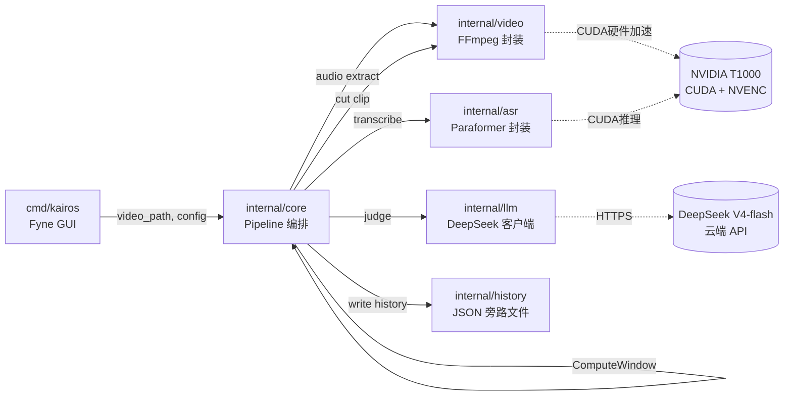
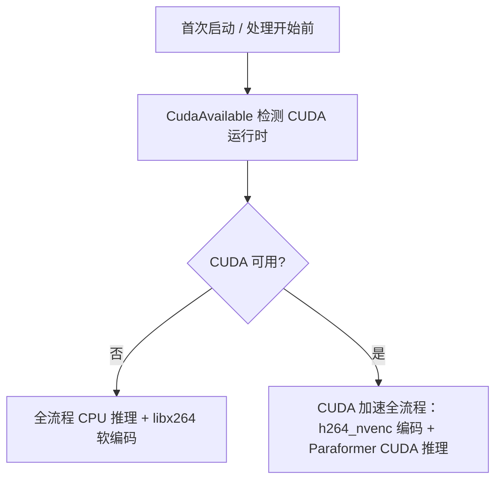

# 短剧高光片段提取器 - 技术实现方案

**Status:** ready-for-agent
**Created:** 2026-07-28（2026-07-30 改为 Go 技术栈）
**Spec:** docs/scratch/short-drama-highlight-clip/spec.md
**Context:** docs/scratch/short-drama-highlight-clip/map.md

本方案是 spec 到代码之间的工程设计文档，回答"具体怎么搭"，不重复 spec 里已经讲清楚的产品决策——业务规则、边界条件、许可证等信息见 spec 原文，这里只讲模块划分、接口、数据流、构建顺序。

**语言选型（已确认，见 map.md Decisions so far）**：Go，不是 Rust——团队实际只熟悉 Go，Rust/C# 均为团队零基础，"团队能否长期维护这份代码"是比技术指标更根本的要求。GUI 显卡实测为 NVIDIA T1000，因此 GPU 加速路径不再需要跨厂商设计，直接锁定 CUDA。

## 架构总览



`internal/core` 是唯一编排者，其余包都是它依赖的能力提供方，互相之间不直接依赖——保证测试缝合点唯一（见 spec.md Testing Decisions）。

## Go 项目结构

```
kairos/
├── go.mod
├── cmd/
│   └── kairos/                 # 二进制入口：Fyne GUI + 组装依赖注入
│       └── main.go
├── internal/
│   ├── core/                   # Pipeline 编排、interface 定义、ComputeWindow、领域类型
│   ├── video/                  # FFmpeg 子进程封装：音轨提取、剪辑、CUDA 检测
│   ├── asr/                    # Paraformer 封装（sherpa-onnx-go），实现 core.Transcriber
│   ├── llm/                    # DeepSeek 客户端（sashabaranov/go-openai），实现 core.HighlightJudge
│   └── history/                # JSON 旁路历史记录（无外部依赖）
└── docs/                       # 现有 scratch 文档
```

采用 Go 惯用的 `cmd/` + `internal/` 布局（`internal/` 保证这些包不会被仓库外部导入，符合"独立桌面应用不是库"的定位），不是简单把 Rust crate 名字换成 package 名字——Go 没有 workspace/crate 这套概念，`internal/xxx` 包名短小写，符合 Go 命名惯例。

依赖方向：`cmd/kairos` → `{core, video, asr, llm, history}`；`internal/core` 是唯一编排者，直接依赖 `video`（提取音轨/剪辑/探测时长）和 `history`（写历史记录）——`asr`/`llm` 不是直接依赖，而是通过 `Transcriber`/`HighlightJudge` 两个 interface 注入，这两个是仅有的测试缝合点。`video`/`asr`/`llm`/`history` 互相之间零依赖，只依赖 `core` 暴露的类型/interface（2026-08-03 修正：原表述"internal/core 不依赖任何其他内部包"与上方架构图的 Core→Video/Core→History 箭头矛盾，以架构图和 ticket 05 的实现为准——`history.Record` 因此改为 `json.RawMessage` 字段而非直接引用 `core.Sentence`/`core.HighlightWindow`，见下方 internal/history 一节，否则 core↔history 会循环 import）。

## 核心接口（internal/core）

```go
package core

// 领域类型
type Sentence struct {
    ID      int
    StartMs uint64
    EndMs   uint64
    Text    string
}

type NarrativeStructure struct {
    Setup        [2]int
    RisingAction [2]int
    Climax       [2]int
    Resolution   *[2]int // nil 表示无明显结局
}

type CandidateWindow struct {
    StartID int
    EndID   int
    Label   string
}

type HighlightWindow struct {
    NarrativeStructure NarrativeStructure
    StartID            int
    EndID              int
    Reason             string
    Candidates         []CandidateWindow
}

type HighlightOutput struct {
    OutputPath  string
    StartMs     uint64
    EndMs       uint64
    Sentences   []Sentence
    JudgeReason string
}

// 两个注入接口（spec 里已定的测试缝合点）——Go interface 是结构化类型，
// 不需要显式 impl 声明，任何实现了对应方法签名的类型自动满足接口
type Transcriber interface {
    Transcribe(audioPath string) ([]Sentence, error)
}

type HighlightJudge interface {
    Judge(sentences []Sentence) (HighlightWindow, error)
}

// 纯函数缝合点（06 文档已定案的窗口算法）——Go 没有 Result<T,E>，
// 用惯用的多返回值 (value, error)；ComputeWindow 本身不会失败，只返回 (uint64, uint64)
func ComputeWindow(peakEndMs, targetLenMs, videoLenMs uint64) (startMs, endMs uint64)

// 唯一编排入口
func RunHighlightExtraction(
    videoPath string,
    config Config,
    transcriber Transcriber,
    judge HighlightJudge,
) (HighlightOutput, error)
```

`RunHighlightExtraction` 内部序列（对应 spec.md Implementation Decisions 的 Pipeline 编排一节）：

1. 校验源文件存在（`os.Stat`），不存在则返回 `ErrSourceFileMissing`
2. 检查目标磁盘可用空间是否够放临时 WAV + 输出文件
3. 调 `video.ExtractAudio()` 提取 16kHz mono WAV 到 `os.MkdirTemp()` 创建的临时目录
4. 调 `transcriber.Transcribe()` 得到 `[]Sentence`
5. 调 `judge.Judge()` 得到 `HighlightWindow`
6. 查表：`sentences[window.EndID].EndMs` 作为 `peakEndMs`，代入 `ComputeWindow()` 得到 `(startMs, endMs)`
7. 调 `video.CutClip()` 用 CUDA 硬件加速编码器截取
8. 清理临时 WAV（`defer os.RemoveAll(tmpDir)`，成功/失败路径都执行——Go 没有 RAII/`Drop`，`defer` 是等价惯用法，保证所有返回路径包括 panic/recover 都会执行）
9. 写入 `history` 记录（JSON 文件）
10. 返回 `HighlightOutput`

## internal/video：FFmpeg 封装

```go
package video

// CUDA 检测——不再需要跨厂商分支（团队实际显卡为 NVIDIA T1000），
// 保留 libx264 作为驱动异常时的安全网，不是为了兼容 AMD/Intel
func CudaAvailable() bool

func SelectEncoder() string // "h264_nvenc" 或降级 "libx264"

func ExtractAudio(videoPath, outWav string) error
// ffmpeg -i {videoPath} -vn -ac 1 -ar 16000 -f wav {outWav}

func CutClip(videoPath string, startMs, endMs uint64, outPath string) error
// ffmpeg -hwaccel cuda -i {videoPath} -ss {startMs/1000} -t {(endMs-startMs)/1000}
//        -c:v {encoder} -c:a aac -y {outPath}
```

`ExtractAudio` 和 `CutClip` 都通过 `os/exec` 启动打包内置的 `ffmpeg.exe`，捕获 stderr 判定失败原因（区分"文件不存在"/"编码器不支持"/"磁盘写入失败"等，映射到具体的 error 变量，不要把 ffmpeg 的原始报错直接抛给 UI）。

## internal/asr：Paraformer 封装

依赖官方 `github.com/k2-fsa/sherpa-onnx-go-windows`，加载打包内置的 Paraformer-large + Silero VAD ONNX 模型文件（原方案 FSMN-VAD，2026-07-31 修正，见 spec.md "本地 ASR 实现"一节）。**注意**：该 Go 绑定的 execution provider 只支持 `cpu`/`cuda`/`coreml`，**不支持 DirectML**——跟 Rust 版 `sherpa-rs` 不同。这对本项目不构成问题，因为已确认硬件是 NVIDIA T1000，CUDA 路径完全够用；但如果未来团队采购了非 N 卡设备，这条选型需要重新评估（届时要么接受该设备只能 CPU 推理，要么重新调研支持 DirectML 的方案）。

```go
package asr

type ParaformerTranscriber struct {
    recognizer *sherpa.OfflineRecognizer
}

func NewParaformerTranscriber(modelDir string, useCuda bool) (*ParaformerTranscriber, error) {
    // 1. 加载 Paraformer-large + Silero VAD + 标点恢复模型
    // 2. provider 设为 "cuda"（useCuda=true）或 "cpu"（降级路径）
}

func (p *ParaformerTranscriber) Transcribe(audioPath string) ([]core.Sentence, error) {
    // 1. 用 sherpa-onnx-go 跑 VAD + Paraformer 推理，拿字级时间戳
    // 2. 用标点恢复模型分句，合并字级时间戳为句级 [{id, start_ms, end_ms, text}]
    // 3. CUDA 初始化失败时返回明确错误，上层决定是否降级 CPU 重试
}
```

## internal/llm：DeepSeek 客户端

```go
package llm

type DeepSeekJudge struct {
    client openai.Client // github.com/sashabaranov/go-openai
    model  string        // "deepseek-v4-flash"
}

func NewDeepSeekJudge(apiKey string) *DeepSeekJudge {
    // openai.NewClientWithConfig，config.BaseURL = "https://api.deepseek.com"
}

func (d *DeepSeekJudge) Judge(sentences []core.Sentence) (core.HighlightWindow, error) {
    // system: 固定 prompt（见 06 文档，广告钩子标准）
    // user: 拼接 sentences 为 "id,start_ms,end_ms,text" 列表
    // ResponseFormat: openai.ChatCompletionResponseFormatTypeJSONObject
    //   （DeepSeek 不支持 json_schema 严格模式，目标 JSON 形状写进 system prompt 文字里）
    // 超时：context.WithTimeout(ctx, 30*time.Second)
    // 拿到响应后 json.Unmarshal 到 HighlightWindow struct，字段缺失/类型不对会报错
}
```

`fm-kafka`（同源 Go 项目）的 `utils/deepseek.go` 已经用同一个库（`sashabaranov/go-openai`）对接过 LLM，只是目前指向本地 ollama——这里需要独立的、指向真实 DeepSeek 云端点的客户端，不能直接复用现有连接配置，但库选型和使用模式可以参考。

## internal/history：JSON 旁路文件（已确认，2026-07-30 修正，原方案为 SQLite）

不用 SQLite——数据量小（单机单团队，一天几十条记录量级），文件系统扫描的性能跟数据库查询没有实质差别，SQLite 换来的查询能力用不上，但要多背一个 cgo 依赖（`mattn/go-sqlite3`）。改为每次处理完（成功或失败）在 `%APPDATA%/kairos/history/` 目录下写一个 JSON 文件：

```go
package history

type Record struct {
    SourcePath        string          `json:"source_path"`
    SourceName        string          `json:"source_name"`
    HighlightPath     string          `json:"highlight_path,omitempty"`
    HighlightStartMs  uint64          `json:"highlight_start_ms,omitempty"`
    HighlightEndMs    uint64          `json:"highlight_end_ms,omitempty"`
    ASRRawResult      json.RawMessage `json:"asr_raw_result,omitempty"`   // 调用方（core）预先 json.Marshal([]core.Sentence) 好再传入
    LLMRawResponse    json.RawMessage `json:"llm_raw_response,omitempty"` // 调用方（core）预先 json.Marshal(core.HighlightWindow) 好再传入
    Status            string          `json:"status"` // "success" | "failed"
    ErrorMessage      string          `json:"error_message,omitempty"`
    CreatedAt         time.Time       `json:"created_at"`
}

func WriteRecord(record Record) error
// 文件名 {created_at 格式化为 20260730-153000}_{source_name}.json，天然按文件名排序即接近按时间排序

func ListRecords() ([]Record, error)
// 扫描 %APPDATA%/kairos/history/ 目录，解析每个 .json 文件，按 created_at 倒序返回
```

## 配置文件

```json
// %APPDATA%/kairos/config.json
{
  "deepseek": {
    "api_key": "",                      // 明文存储（默认档）
    "use_credential_manager": false     // true 时改从 Windows 凭据管理器读取，此字段仅存开关
  },
  "output": {
    "default_dir": ""                   // 空 = 源文件同目录
  }
}
```

用标准库 `encoding/json` 读写，不引入 TOML 依赖（已确认，2026-07-30 修正，原方案为 TOML）——配置内容极简（3 个字段），且项目已经在别处（DeepSeek API 请求/响应、历史记录旁路文件）用 JSON，复用同一套序列化方式比额外引入 `BurntSushi/toml` 更省。TOML"人类友好、支持注释"的优势在"文件由软件读写、用户不手改"这个场景下发挥不出来。

## cmd/kairos：输入/输出交互设计

两步显式选择，不做隐藏的自动推断，都用 **Fyne 内置 `dialog` 包**（`fyne.io/fyne/v2/dialog`，系统原生文件/文件夹选择对话框，不需要像 Rust 版那样额外引入 `rfd` 库——Fyne 自带）：

1. **选择输入视频文件**：主窗口一个拖放区域，文案"拖入视频文件，或点击选择"；点击时用 `dialog.ShowFileOpen()` 弹出系统文件选择对话框，过滤 mp4/mov/avi/webm；拖放和点击选择走同一个内部事件，逻辑不分叉。
2. **选择输出目录**：选定输入文件后，界面立即出现"输出目录"一行，默认预填源文件所在目录（`filepath.Dir(videoPath)`）；用户可以直接接受默认值，或点击"更改"用 `dialog.ShowFolderOpen()` 弹出系统文件夹选择对话框自定义。
3. **自动开始**：输出目录一旦确定（默认值被接受，或用户完成"更改"选择），立即调用 `core.RunHighlightExtraction()`，没有独立的"开始"按钮——第 2 步的选择动作本身就是触发点。

## 错误处理策略

Go 惯用的 `error` 接口 + 哨兵错误（sentinel errors，用 `errors.New`/`fmt.Errorf` 定义包级变量），不使用 Rust `thiserror` 那套派生宏（Go 生态没有直接对等物，也不需要）：

```go
package core

var (
    ErrSourceFileMissing     = errors.New("source file missing")
    ErrInsufficientDiskSpace = errors.New("insufficient disk space")
    ErrAudioExtractionFailed = errors.New("audio extraction failed")
    ErrTranscriptionFailed   = errors.New("transcription failed")
    ErrLlmTimeout            = errors.New("llm request timeout")
    ErrLlmInvalidResponse    = errors.New("llm returned invalid response")
    ErrClipExtractionFailed  = errors.New("clip extraction failed")
    ErrGpuUnavailable        = errors.New("gpu unavailable") // 触发 CPU 降级而非直接报错
)
```

GUI 层用 `errors.Is()` 判定具体错误类型做用户可读的提示，不把底层 `ffmpeg`/`go-openai` 报错原文直接展示。

**错误传播**：每层用 `fmt.Errorf("阶段描述: %w", err)` 包装错误往上传，`%w` 保留原始哨兵错误不丢失，上层仍能用 `errors.Is()` 判定具体类型；同时每层包装都在错误信息里加一句人话描述（"提取音轨失败: xxx"），不是简单转发原始错误。

**日志**：用标准库 `log/slog`（Go 1.21+ 内置结构化日志，不引入第三方依赖如 zap/zerolog——这个项目的日志量级不需要它们的高性能/分级/轮转能力），写到 `%APPDATA%/kairos/app.log`，不做日志轮转（内部工具日志量级小，暂不需要；文件无限增长是已知的简化，不是现在的问题）。记录内容：
- 软件启动/退出
- `RunHighlightExtraction()` 每个阶段的开始/成功/失败（带耗时）
- CUDA 检测结果（可用/不可用，检测失败原因）
- 任何被 `recover()` 捕获的 panic（含堆栈）

**日志文件 vs 历史记录 JSON——两者不是重复设计**：历史记录（`internal/history`）是"这个视频这次处理的业务级摘要"，按视频维度检索，面向"为什么这条片段效果不好"这类问题；日志文件是"整个软件运行期间的技术级流水账"，面向"软件为什么启动不了/为什么全局崩溃"这类问题——历史记录写不进去的场景（比如还没跑到写历史记录那一步就崩了）日志文件能兜底。

**Panic 兜底**：GUI 层调用 `RunHighlightExtraction()` 的地方包一层 `defer func() { if r := recover(); r != nil { ... } }()`——捕获意外 panic（比如空指针），记录到日志（含堆栈），给用户看一个通用的"处理异常，请查看日志"提示，软件本身不崩溃退出。预期的错误（文件缺失、超时等）走正常的 `error` 返回值路径，不应该走到 panic 这一步；panic 兜底只是防止未预见到的 bug 直接让整个软件死掉。

## GPU 检测与降级流程



跟 Rust 方案的跨厂商检测树相比，这条流程简化了很多——不再需要按显卡厂商分支选编码器（`h264_nvenc`/`h264_amf`/`h264_qsv`三选一），因为团队实际硬件确认是 NVIDIA T1000，只需要"CUDA 可用/不可用"两条分支。这是硬件确认后的合理简化，不是偷工减料——之前的跨厂商设计是为未知硬件做的保险，现在保险费不用交了。

## 实施阶段（建议构建顺序）

按依赖顺序 + 可验证性排列，每阶段结束都有可独立验证的产出：

1. **Go module 骨架 + `ComputeWindow()`** —— 零 I/O 纯函数，先写满 spec 里那张边界用例表的单元测试，跑通 `go test`
2. **`internal/video`** —— FFmpeg 音轨提取 + 剪辑 + CUDA 检测，用一个预置 5 秒测试 MP4 验证端到端可产出文件
3. **`internal/asr`** —— Paraformer 集成，用同一个测试音频验证转写输出结构正确（需要真实模型文件，本阶段不追求准确率只追求跑通）
4. **`internal/llm`** —— DeepSeek 客户端，用固定台词文本验证能拿到合法 JSON 响应（需要真实 API Key）
5. **`internal/core` 编排** —— 用 mock `Transcriber`/`HighlightJudge` 跑通 `RunHighlightExtraction()` 全流程测试，不依赖真实 GPU/网络，只验证编排逻辑本身对不对
6. **真实素材端到端验证** —— 把 2/3/4 步的真实实现（不再用 mock）接入 `RunHighlightExtraction()`，用 1 条真实短剧素材完整跑一遍，人工看效果：转写文本是否基本准确、LLM 挑的窗口是否适合做广告钩子、剪出来的片段观感如何。这一步是"结构对不对"和"效果好不好"之间第一次真实校验——通不过就回头调 prompt/参数，不急着往下走建 GUI
7. **`internal/history`** —— JSON 旁路文件建目录 + 写入/扫描历史记录
8. **`cmd/kairos` GUI（Fyne）** —— 组装以上所有包，实现输入文件选择（拖拽 + 系统对话框）、输出目录选择（系统对话框）、进度展示、结果预览、历史列表、首次运行引导
9. **打包** —— `go-msi` 出 MSI，内置 FFmpeg + 模型文件 + CUDA/cuDNN 运行时 DLL，验证全新 Windows 环境下安装即用

每个阶段建议对应一张 to-tickets 生成的 ticket。阶段 1-5、7 可并行铺开（互相之间只通过 interface 接口耦合，history 与其余几个包互不依赖）；阶段 6 依赖 2/3/4/5 全部完成（需要真实实现，不是 mock）；阶段 8 依赖 1-7 全部完成；阶段 9 依赖 8。

## 关键依赖清单

| Package | 用途 |
|---|---|
| `github.com/k2-fsa/sherpa-onnx-go-windows` | Paraformer ONNX 推理（官方绑定，CUDA provider） |
| `github.com/sashabaranov/go-openai` | DeepSeek HTTP 客户端（OpenAI 兼容接口封装；fm-kafka 已有先例） |
| `fyne.io/fyne/v2` | GUI，含内置文件/文件夹对话框（`fyne.io/fyne/v2/dialog`），不需要额外的对话框库 |
| `github.com/danieljoos/wincred`（可选） | Windows 凭据管理器封装，用于 API Key 加密存储 |
| `go-msi`（构建时工具） | 打包（非运行时依赖，封装 WiX） |

## CUDA 运行时打包（技术核实过，不是假设）

ONNX Runtime 的 CUDA execution provider **不能只靠 ONNX Runtime 自身的包**，需要额外打包匹配版本的 NVIDIA 运行时 DLL：`cudart64_*.dll`、`cublas64_*.dll`、`cublasLt64_*.dll`、`cufft64_*.dll`、`curand64_*.dll`、`cudnn*.dll`。这些 DLL 放在 exe 同目录即可被加载，不需要用户系统装完整 CUDA Toolkit。NVIDIA 官方允许这些运行时 DLL 按其许可条款重新分发（需要在安装包里附带 NVIDIA 许可声明）。**用户仍需自行安装匹配的 NVIDIA 显卡驱动**——驱动本身不能塞进安装包，但 T1000 这类工作站显卡出厂/IT 部署时通常已经装好驱动，属于正常预期，不是额外负担。ORT/CUDA/cuDNN 版本要严格匹配（cuDNN 8.x 和 9.x 不能混用），这条在打包阶段需要锁定具体版本号，不能随意升级其中一个。

## 与既有文档的关系

- 业务决策、User Stories、Out of Scope：见 spec.md
- 窗口算法完整推导与边界用例、广告钩子判定标准：见 `06-highlight-window-algorithm.md`
- ASR/LLM 选型依据：见 `01-asr-llm-vendor-research.md` + `01-research-findings.md`
- GPU 策略从跨厂商简化为 NVIDIA-only、语言从 Rust 改为 Go 的决策背景：见 `map.md` Decisions so far
